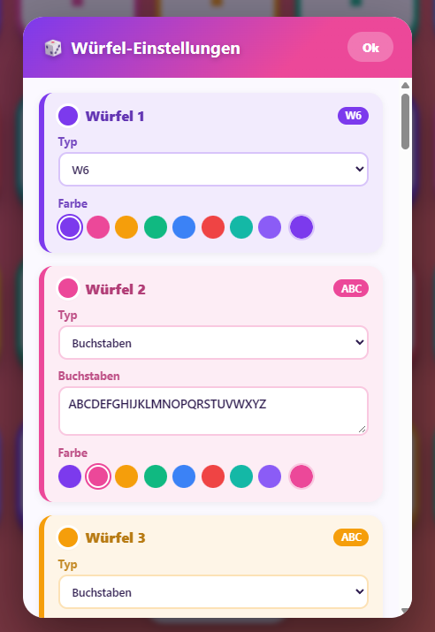

# 🎲 Wuffel

Eine bunte, animierte Würfel-App als PWA – für spontane Spiele unterwegs.

**Live:** https://wuffel.nichtregistriert.de/

## Screenshots

| Startbildschirm | 20 Buchstabenwürfel | Einstellungen |
|---|---|---|
|  |  |  |

## Features

- Ein oder mehrere Würfel gleichzeitig, jeder einzeln anklickbar
- Würfeltypen: W4, W6, W8, W10, W12, W20, freier Zahlenbereich, Buchstabenwürfel (z. B. für Stadt-Land-Fluss)
- Animierter Wurf beim Antippen
- Frei wählbare Farbe pro Würfel
- Einstellungen werden lokal gespeichert (localStorage)
- Installierbar als App (PWA), funktioniert offline

## Lokal starten

Da es sich um eine reine HTML/CSS/JS-App ohne Build-Schritt handelt, reicht ein einfacher lokaler Webserver
(Service Worker funktionieren nicht über `file://`):

```bash
npx serve .
# oder
python -m http.server 8080
```

Danach im Browser öffnen: `http://localhost:8080` (Port je nach Tool).

## Struktur

```
index.html          Grundgerüst der Seite
css/style.css        Styling & Animationen
js/app.js            App-Logik (Würfel-Zustand, Rendering, Rollen)
manifest.json         PWA-Manifest
service-worker.js     Offline-Caching
icons/                App-Icons
```
